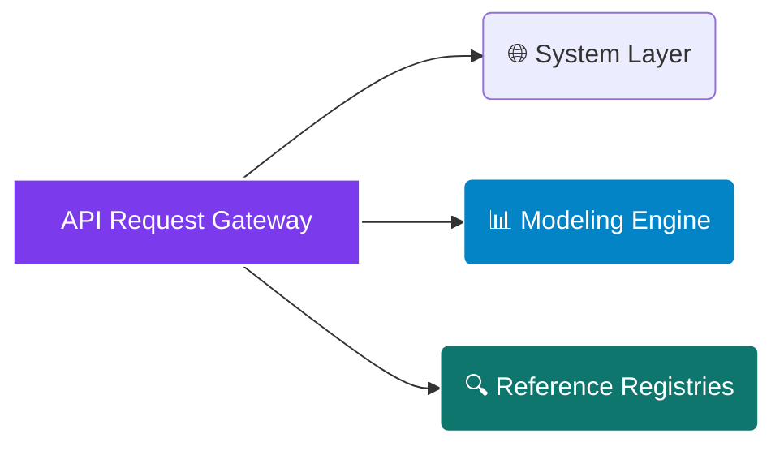

# <p align="center"></p>

<div align="center">

  <p><strong>The Only Research-Grade Building-Integrated Photovoltaics (BIPV) Structural Performance &amp; Wind Action Underwriting Engine Built for High-Vertical Urban Envelopes</strong></p>

</div>

<div align="center">

  <a href="https://rapidapi.com/bethelnedi/api/bipv-structural-load-api"></a>
  <a href="https://elements.stoplight.io/viewer/?spec=https://raw.githubusercontent.com/bethelhash/BIPV-Structural-Load-API/refs/heads/main/openapi.json"></a>
  
  
  

</div>

---

## ⚡ Executive Summary

The **BIPV Structural Load API** is a deterministic computational engine purpose-built to evaluate the structural design loads of photovoltaic systems integrated into building envelopes. Moving away from standard rooftop PV arrays where wind interactions are modeled in isolation, this engine accurately targets high-vertical curtain walls, rain-screens, ventilated facade systems, and architectural roofs.

By executing height-dependent boundary layer equations across international structural codes (**EN 1991-1-4** and **ASCE 7-22** Components &amp; Cladding) alongside micro-level air permeability correction filters, the engine generates audit-ready mechanical loading configurations, bracket structural forces, and serviceability deflection checks in **under 500ms**.

<blockquote align="left">

  <strong>💎 AUDIT-READY STRUCTURAL DEFENSE</strong><br>

  Developed by a structural engineering researcher specializing in sustainable envelopes, this engine completely removes analytical black-box risks. Every single pressure coefficient, self-weight allocation, and structural load combination layout maps directly back to a validated code paragraph or peer-reviewed publication (such as Miller &amp; Kopp 2024), providing a bankable chain of custody for engineering submittals.

</blockquote>

---

## 🏛️ Enterprise Core Capabilities

<table width="100%">
  <tr>
    <td width="50%" valign="top">
      <h3>📈 Advanced Facade Loading</h3>
      <ul>
        <li><strong>Pressure Equalization Modeling:</strong> Integrates modern multi-variable equations (Miller &amp; Kopp 2024) to evaluate the partial pressure equalization occurring in rear air cavities of ventilated BIPV rain-screens.</li>
        <li><strong>Unified Wind Coding:</strong> Switches fluidly between European Eurocode standard protocols and US ASCE 7-22 Chapter 30 Components and Cladding (C&amp;C) design guidelines.</li>
        <li><strong>ULS Load Combinations:</strong> Automatically handles combination rules per EN 1990 Table A1.2(B) to generate governing ultimate load cases under negative suction constraints.</li>
      </ul>
    </td>
    <td width="50%" valign="top">
      <h3>🔌 Mechanical Fixing &amp; Verification</h3>
      <ul>
        <li><strong>Fixing Force Mechanics:</strong> Uses tributary-area structural engineering principles to map distributed wind pressures directly down to localized shear and pull-out bracket point forces (kN).</li>
        <li><strong>SLS Deflection Sweeps:</strong> Conducts serviceability limit state strain reviews against standard L/200 thresholds, factoring in exact glass-glass and panel geometry variables.</li>
        <li><strong>Whole-Elevation Mapping:</strong> Evaluates complete wind vectors across high-suction building zones simultaneously, isolating edge-corner suction boundaries cleanly.</li>
      </ul>
    </td>
  </tr>
</table>

---

## 🗺️ Market Architecture Hub

### 🌍 Integrated Structural Codes
The physics core operates simultaneously on dominant global engineering and structural architecture framework boundaries:
`EN 1991-1-4 (Eurocode Wind)` &middot; `EN 1990 (Basis of Design)` &middot; `EN 1991-1-1 (Dead Loads)` &middot; `ASCE 7-22 (US Components &amp; Cladding)`

### 📊 Structural Glass &amp; Panel Materials
Dead loads and self-weights are derived from accurate glass-thickness configurations and physical compound metrics:
`Glass-Glass Standard (22 kg/m²)` &middot; `Glass-Glass Thin (17 kg/m²)` &middot; `Glass-Backsheet (12.5 kg/m²)` &middot; `Thin-Film Glass (15 kg/m²)` &middot; `Flexible Lightweight (3.5 kg/m²)`

---

## 📂 API Core Endpoint Directory



---

### 🌐 System Layer

* `GET /` — Exposes active API structural indices, build versions, and configuration frameworks.
* `GET /health` — Validates real-time system operational health, proxy connectivity, and logs the peer-reviewed methodology registry.
* `GET /pricing` — Returns active platform tier restrictions, execution rate limits, and product feature inclusions.

### 📊 Modeling Engine

* `POST /calculate` — Primary structural calculation node. Ingests precise site terrain data, building geometry coordinates, panel materials, and fixing specs to output net pressure arrays, bracket pull-out/shear loads, and SLS validations. *(Free Tier)*
* `POST /all-zones` — Whole-elevation loading engine. Evaluates wind action profiles simultaneously across all localized envelope pressure boundaries (Zones A through E) to isolate governing anchor locations in a single operation. *(Pro Tier)*

### 🔍 Reference Registries

* `GET /reference/terrain-categories` — Pulls structural roughness parameters, friction heights, and topography modifiers per Eurocode standards.
* `GET /reference/panel-weights` — Exposes materials mass properties for structured dead-load calculations.
* `GET /reference/pressure-zones` — Exposes external pressure coefficient datasets (Cpe 10 and Cpe 1) for various facade architectural geometries.
* `GET /reference/wind-speed-map` — Provides regional fundamental basic wind velocity metrics and map guidance limits.

---

## 📈 Engineering Methodology & Verification Matrix

The engine completely avoids arbitrary point assumptions. Every operational block traces directly to historical code documentation to pass structural peer review panels:

| Calculation Block | Governing Code / Standard | Primary Academic / Institutional Source Citation |
| --- | --- | --- |
| **Velocity Pressure qp(z)** | EN 1991-1-4:2005 Eq.(4.8) | Eurocode 1: Actions on structures - General actions - Wind actions |
| **Pressure Coefficients Cpe** | EN 1991-1-4:2005 Table 7.1 | Facade wall external pressure boundary zone arrays (Zones A, B, C, D, E) |
| **Cavity Equalization** | Cavity Permeability Correction | Miller & Kopp (2024) Frontiers in Built Environment |
| **Net Pressure Interaction** | EN 1991-1-4:2005 Paragraph 5.2 | Final summation layout of simultaneous external and internal wind pressures |
| **Permanent Dead Actions** | EN 1991-1-1:2002 Annex A | Eurocode 1: Densities, self-weight, imposed actions for buildings |
| **Structural Combinations** | EN 1990:2002 Table A1.2(B) | Ultimate Limit State (ULS) design load calculations (Equation 6.10a/b core) |
| **Fixing Forces / Reactions** | EN 1990:2002 Paragraph 6.4 | Tributary mechanical resolution of bracket pull-out and vertical shear forces |
| **Deflection SLS Strains** | Characteristic Verification Loop | Yin et al. (2023) Engineering Structures |
| **US Component Wind Loads** | ASCE 7-22 Chapter 30 | Minimum Design Loads and Associated Criteria for Buildings (C&C Method) |

---

## 🚀 Quickstart Integration Example (Python)

To programmatically post a complete structural facade bracket loading query through the enterprise computing proxy, run the script below:

```python
import json
import requests

# Core Routing Configuration via RapidAPI Gateway
GATEWAY_URL = "[https://bipv-structural-load-api.p.rapidapi.com/calculate](https://bipv-structural-load-api.p.rapidapi.com/calculate)"

payload = {
    "site": {
        "basic_wind_speed_ms": 28,
        "terrain_category": "II",
        "altitude_m": 50,
        "building_height_m": 30,
        "building_width_m": 40,
        "building_depth_m": 20,
        "standard": "EN"
    },
    "panel": {
        "panel_type": "glass_glass_standard",
        "panel_width_m": 1.0,
        "panel_height_m": 1.7,
        "panel_thickness_mm": 12.0
    },
    "installation": {
        "installation_type": "ventilated_facade_bracket",
        "facade_zone": "B",
        "tilt_deg": 90,
        "is_ventilated": True,
        "air_gap_mm": 50,
        "fixing_points": 4,
        "bracket_spacing_m": 0.85,
        "surface_type": "wall",
        "cpi": 0.0
    }
}

headers = {
    "Content-Type": "application/json",
    "X-API-Key": "YOUR_SECURE_MARKETPLACE_TOKEN",
    "X-RapidAPI-Host": "bipv-structural-load-api.p.rapidapi.com"
}

response = requests.post(GATEWAY_URL, json=payload, headers=headers)
print(json.dumps(response.json(), indent=2))

```

---

## 💎 Production Access Tiers

| Tier Classification | Monthly Access Fees | Active Rate Latency Caps | Inclusive Data Volume Quota | Programmatic Endpoint Access | Support Service Level |
| --- | --- | --- | --- | --- | --- |
| **Free Tier Core** | $0 / Month | 5 Requests / Minute | 10 Calls / Month | `/calculate` (Single Zone) + Reference | Open Community Forum |
| **Pro Enterprise** | $49 / Month | 1,000 Requests / Hour | Unlimited | Full Endpoint Suite + Multi-Zone Arrays | Standard Service SLA |
| **Ultra Institutional** | $199 / Month | 1,000 Requests / Hour | Unlimited | Full Access + Full White-Label Rights | Dedicated Operations SLA |

* **Platform Tool Access & Sandboxes:** Pro and Ultra tiers unlock direct key validation on the [BIPV Structural Load Tool (bipv-structural-tool.vercel.app)](https://www.google.com/search?q=https://bipv-structural-tool.vercel.app/). Entering an active Pro token generates complete structural combination data sets, deflection plots, and engineering print profiles.
* **White-Label Integration Deployment:** Ultra tier subscribers gain structural rights to remove native branding metrics and frame the interactive design framework directly on corporate engineering domains or manufacturer client web spaces (subject to a 1-day deployment domain validation).

---

## 🔒 Proprietary License & Terms

### Intellectual Property Protection

**Copyright © 2026 Axiom Infrastructure Intelligence LLP. All rights reserved.**

The BIPV Structural Load API, its behind-the-scenes wind boundary algorithm modules, pressure equalization processing blocks, parameter interface maps, and structural source datasets are the exclusive proprietary intellectual property of Axiom Infrastructure Intelligence LLP. No part of this endpoint design schema, calculation hierarchy, or code infrastructure may be replicated, reverse-engineered, white-labeled, or redistributed without an active Master Services Agreement (MSA) and express written licensing permission from the corporate rights holder.

### Technical Disclaimer

All pressure metrics, mechanical force distribution arrays, and structural limit status updates generated by this core model serve as high-fidelity scoping screens for early design-phase evaluations. Project planners must engage a licensed professional structural engineer bound to local building codes, a certified facade designer, and an accredited technical testing center before completing final bracket selection, fixing anchor specification, or commencing on-site structural installations.

```

```
